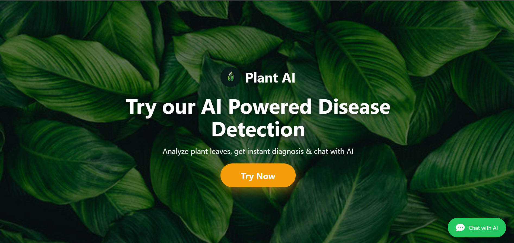
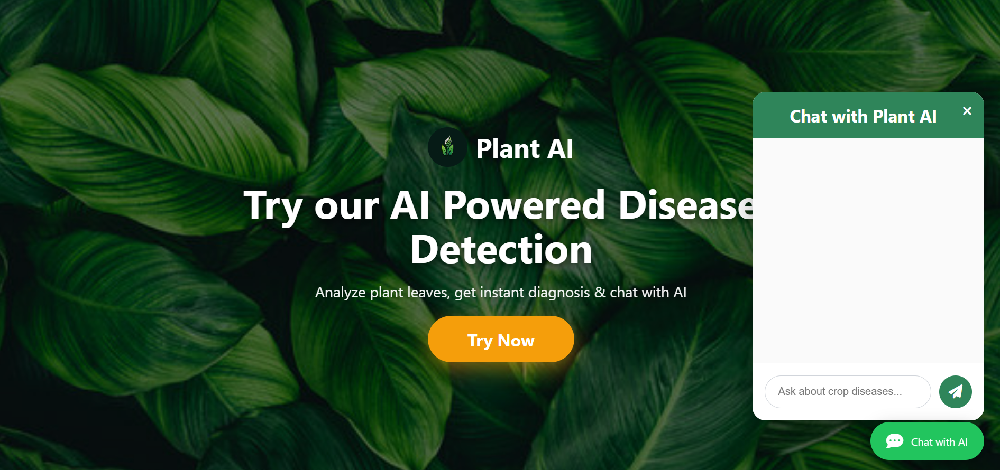
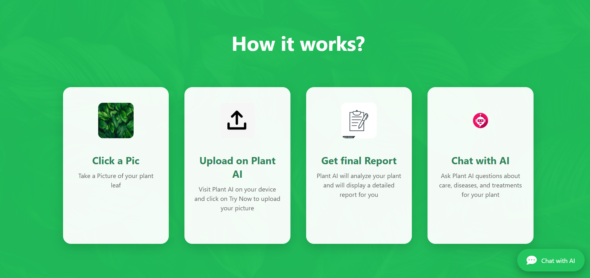
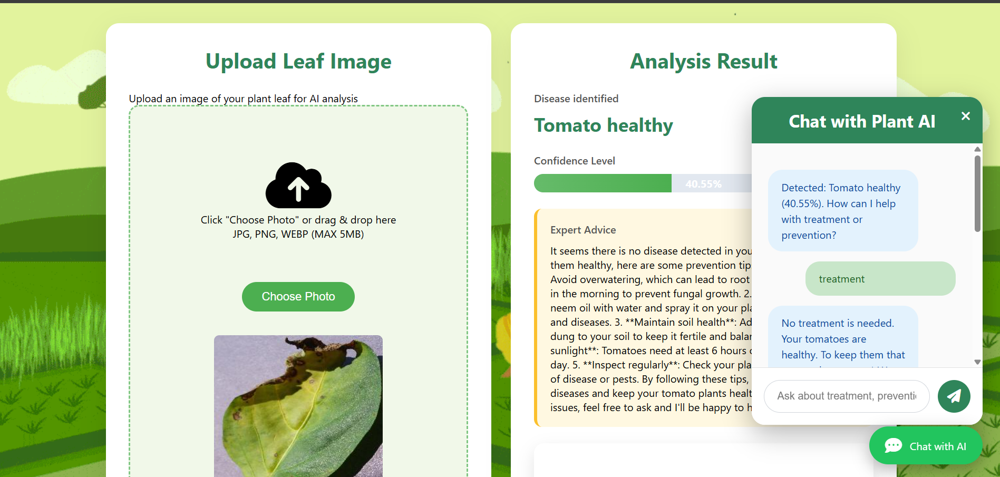
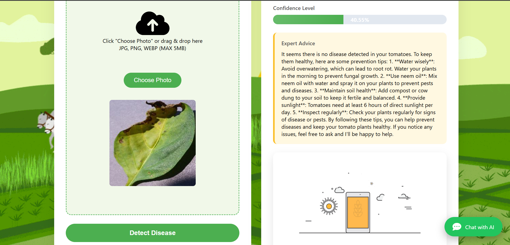

# Crop Disease Detection AI + Chatbot

This repository contains a plant disease detection web app with a chat assistant for crop advice.
The backend is built with Flask and TensorFlow, and the frontend is a simple image upload + chat UI.

## 🌱 Plant AI Demo

Here are some screenshots of the application:







## ✨ Features

- **Leaf Image Upload** with drag & drop support.
- **Disease Detection** using Deep Learning (MobileNetV2)
- **Confidence Score** with visual progress bar
- **Expert Advice** powered by Google Gemini AI + FAQ system
- **Interactive Chat** - Ask any questions about treatment or prevention
- **Beautiful & Responsive UI** with green agricultural theme
- **Practical Sri Lanka-focused advice** (neem oil, cow urine, monsoon tips, etc.)

## 🛠️ Tech Stack

### Backend
- **Python** + **Flask**
- **TensorFlow / Keras** (MobileNetV2 - Transfer Learning)
- **Google Gemini API** (for intelligent advice)
- **Pandas** (FAQ system)

### Frontend
- **HTML5, CSS3, JavaScript**
- Drag & Drop Upload
- Real-time Chat Interface

### Dataset
- PlantVillage Dataset (15 classes: Tomato, Potato, Pepper diseases)

## Setup

1. Open a terminal in the repo root:
   ```powershell
   cd C:\Users\User\Desktop\CHATBOT
   ```

2. Create and activate a Python virtual environment:
   ```powershell
   python -m venv venv
   .\venv\Scripts\Activate.ps1
   ```

3. Install dependencies:
   ```powershell
   pip install -r requirements.txt
   ```

4. Copy the example environment file:
   ```powershell
   copy .env.example .env
   ```

5. Open `.env` and add your Groq API key:
   ```text
   GROQ_API_KEY=your_groq_api_key_here
   ```

## Run the app

From the repo root:
```powershell
python backend\app.py
```

Then open your browser at:

- `http://127.0.0.1:5000` for the landing page
- `http://127.0.0.1:5000/upload` to upload a leaf image

## Notes

- `backend/app.py` expects `plant_disease_model.h5` and `class_indices.json` in the repo root.
- If the model file is missing or broken, train a new model by running:
  ```powershell
  python backend\train_cnn.py
  ```
- The chat assistant uses a Groq API key from `.env`.
- The repository ignores local environment files and build artifacts via `.gitignore`.

## Project structure

- `backend/` – Flask backend, model training, and image prediction code
- `chat/` – chatbot integration and prompt logic
- `frontend/` – HTML, CSS, JS, and static uploads
- `requirements.txt` – root dependency list for the repo
- `.gitignore` – files and folders excluded from Git

## Troubleshooting

- If TensorFlow fails to load, confirm your Python version and installed packages.
- If the chatbot raises `GROQ_API_KEY not found`, make sure `.env` exists and contains the key.
- If the app cannot find `plant_disease_model.h5`, place the model file in the repo root or retrain from `backend/train_cnn.py`.
